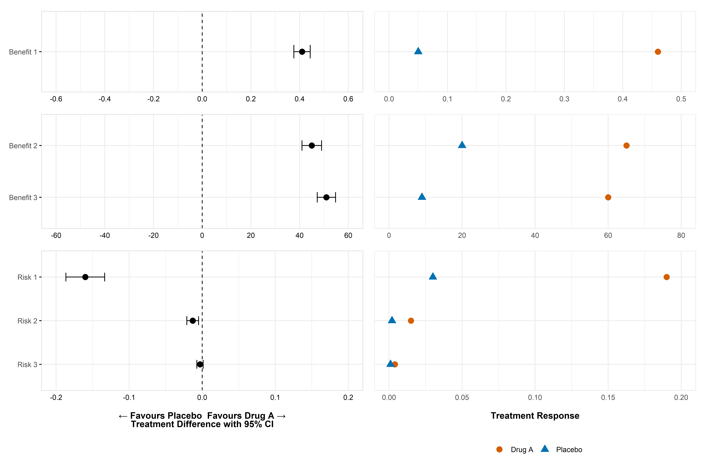
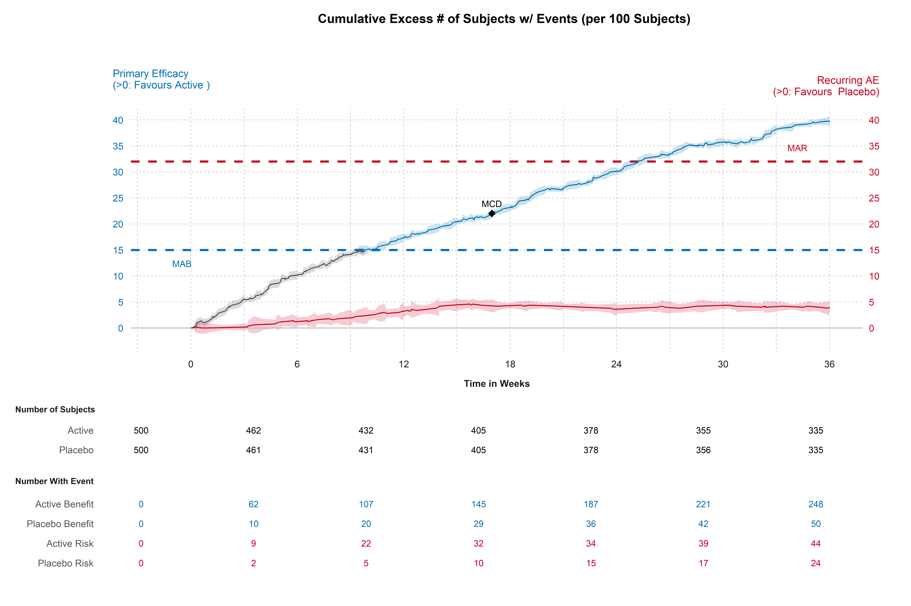

<!-- README.md is generated from README.Rmd. Please edit that file -->

# brpubVJCE �

<!-- badges: start -->

[](https://app.codecov.io/gh/BR-Visualization/brpubVJCE)
[](https://lifecycle.r-lib.org/articles/stages.html#experimental)
<!-- badges: end -->

The goal of brpubVJCE is to generate benefit-risk visualizations for the
publication “How to visually integrate value judgment with clinical
evidence”.

# Table of Contents

- [Installation](#installation)
- [Figure - Dot-Forest Plot](#figure---dot-forest-plot)
- [Figure - Cumulative Excess Plot](#figure---cumulative-excess-plot)

## Installation

You can install the development version of brpubVJCE from
[GitHub](https://github.com/) using the following methods:

### Recommended Installation

``` r
# Install using pak (recommended)
install.packages("pak")
#> The following package(s) will be installed:
#> - pak [0.9.0]
#> These packages will be installed into "C:/Users/aemab/AppData/Local/R/cache/R/renv/library/brpubVJCE-f8740ab8/windows/R-4.5/x86_64-w64-mingw32".
#> 
#> # Installing packages --------------------------------------------------------
#> - Installing pak ...                            OK [linked from cache]
#> Successfully installed 1 package in 19 milliseconds.
pak::pak("BR-Visualization/brpubVJCE")
#> ℹ Loading metadata database✔ Loading metadata database ... done
#>  
#> ℹ No downloads are needed
#> ✔ 1 pkg + 43 deps: kept 36 [7.8s]
```

### Alternative Installation

``` r
# Install using remotes
install.packages("remotes")
#> The following package(s) will be installed:
#> - remotes [2.5.0]
#> These packages will be installed into "C:/Users/aemab/AppData/Local/R/cache/R/renv/library/brpubVJCE-f8740ab8/windows/R-4.5/x86_64-w64-mingw32".
#> 
#> # Installing packages --------------------------------------------------------
#> - Installing remotes ...                        OK [linked from cache]
#> Successfully installed 1 package in 17 milliseconds.
remotes::install_github("BR-Visualization/brpubVJCE")
#> Using GitHub PAT from the git credential store.
#> Skipping install of 'brpubVJCE' from a github remote, the SHA1 (3d136d27) has not changed since last install.
#>   Use `force = TRUE` to force installation
```

## Figure - Dot-Forest Plot



<details>

<summary>

Click to learn more
</summary>

**Getting Help**

- Documentation: Use `?create_forest_dot_plot` or
  `?prepare_forest_dot_data` for detailed function help
- Issues: Report bugs at [GitHub
  Issues](https://github.com/BR-Visualization/brpubVJCE/issues)  
- Discussions: Join discussions at [GitHub
  Discussions](https://github.com/BR-Visualization/brpubVJCE/discussions)
- Contact: Reach out to the package maintainers via GitHub

</details>

<details>

<summary>

Click to view sample code
</summary>

``` r
# Load the package and create the plot
library(brpubVJCE)

# Prepare the data and create the visualization
result_plot <- create_forest_dot_plot(
  prepare_forest_dot_data(effects_table)
)

# Display the plot
result_plot
```

</details>

## Figure - Cumulative Excess Plot



<details>

<summary>

Click to learn more
</summary>

**Getting Help**

- Documentation: Use `?gensurv_combined` for detailed function help
- Issues: Report bugs at [GitHub
  Issues](https://github.com/BR-Visualization/brpubVJCE/issues)  
- Discussions: Join discussions at [GitHub
  Discussions](https://github.com/BR-Visualization/brpubVJCE/discussions)
- Contact: Reach out to the package maintainers via GitHub

</details>

<details>

Click to view sample code
</summary>

``` r
library(brpubVJCE)

gensurv_combined(
  df_plot = cumexcess, subjects_pt = 100, visits_pt = 6,
  df_table = cumexcess, fig_colors_pt = colfun()$fig13_colors,
  rel_heights_table = c(1, 0.5),
  legend_position_p = c(.1, 1.56),
  titlename =
    "Cumulative Excess # of Subjects w/ Events (per 100 Subjects)",
  mar = 32,
  mab = 15,
  mcd = 22
)
```

</details>

## Citation

If you use this package in your research, please cite:

``` r
citation("brpubVJCE")
```

## License

This package is licensed under the MIT License. See the
[LICENSE](LICENSE.md) file for details.

------------------------------------------------------------------------

*Built with ❤️ for the benefit-risk visualization community*
