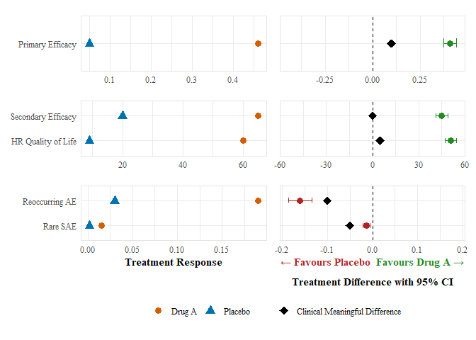

<!-- README.md is generated from README.Rmd. Please edit that file -->

# brpubVJCE

<!-- badges: start -->

[](https://app.codecov.io/gh/BR-Visualization/brpubVJCE)
<!-- badges: end -->

The goal of brpubVJCE is to generate benefit-risk visualizations for the
publication “How to visually integrate value judgment with clinical
evidence”.

## Installation

You can install the development version of brpubVJCE from
[GitHub](https://github.com/) with:

``` r
# install.packages("pak")
pak::pak("BR-Visualization/brpubVJCE")
```

## Example

This is a basic example which shows you how to solve a common problem:

``` r
library(brpubVJCE)
create_forest_dot_plot(
  prepare_forest_dot_data(effects_table)
)
```


