# MCDA Value Function Types

## Introduction

Value functions are mathematical transformations that convert raw
clinical outcome values into a standardized scale (typically 0-100)
representing “value” or “desirability” from a decision-making
perspective. The choice of value function reflects stakeholder
preferences about how outcomes are valued.

## Why Value Functions Matter

Consider an adverse event rate: - **Linear**: Going from 10% to 20% AE
rate has the same negative value as 20% to 30% - **Exponential**: Going
from 10% to 20% is concerning, but 20% to 30% is dramatically worse -
**Threshold**: Below 15% is acceptable (value=100), above 15% is
unacceptable (value=0)

The choice affects benefit-risk conclusions and should reflect clinical
reality and stakeholder preferences.

## Value Function Types

### 1. Linear Value Functions (Current Standard)

**Description**: Constant marginal value - each unit change has equal
importance

**Increasing direction** (higher is better, e.g., efficacy):
$$v(x) = 100 \times \frac{x - \text{min}}{\text{max} - \text{min}}$$

**Decreasing direction** (lower is better, e.g., adverse events):
$$v(x) = 100 \times \frac{\text{max} - x}{\text{max} - \text{min}}$$

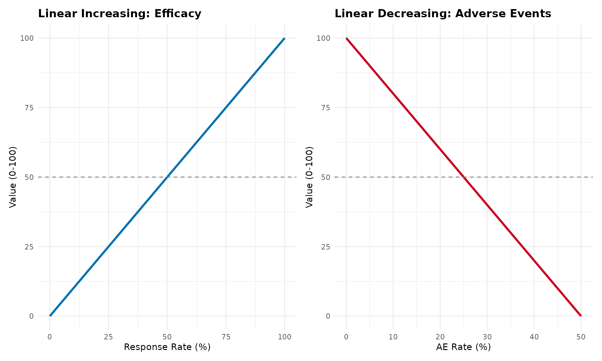

**When to use:** - Default choice (FDA/EMA recommendation) - No strong
evidence of non-linear preferences - Transparency and simplicity are
priorities - Most clinical outcomes

**Advantages:** - Simple and interpretable - Transparent calculations -
Regulatory acceptance - Conservative (neutral) assumptions

**Disadvantages:** - May not reflect true stakeholder preferences -
Assumes equal marginal value across range

------------------------------------------------------------------------

### 2. Piecewise Linear Value Functions

**Description**: Different slopes in different regions, connected at
breakpoints

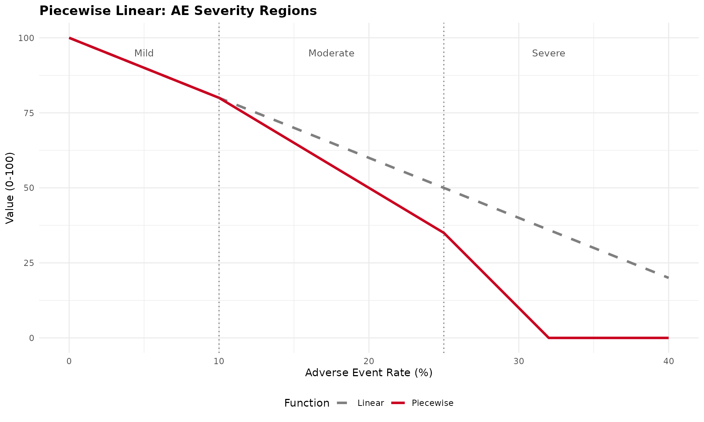

**When to use:** - Clinical guidelines define severity categories
(mild/moderate/severe) - Regulatory thresholds exist
(acceptable/concerning/unacceptable) - Stakeholders value ranges
differently - MCID (Minimally Clinically Important Difference) creates
natural breakpoints

**Example applications:** - QoL scales with clinical interpretation
bands - Lab values with normal/borderline/abnormal ranges - Dose levels
with safety thresholds

**Advantages:** - Captures clinical interpretation thresholds - More
flexible than linear - Still relatively transparent - Can match
stakeholder preferences better

**Disadvantages:** - More parameters to justify - Arbitrary breakpoint
placement needs rationale - More complex than linear

------------------------------------------------------------------------

### 3. Exponential/Power Value Functions

**Description**: Curved relationship reflecting risk attitudes

**Risk-averse (diminishing returns)**, b \> 1:
$$v(x) = 100 \times \left( \frac{x - \text{min}}{\text{max} - \text{min}} \right)^{b}$$

**Risk-seeking (increasing returns)**, 0 \< b \< 1:
$$v(x) = 100 \times \left( \frac{x - \text{min}}{\text{max} - \text{min}} \right)^{b}$$

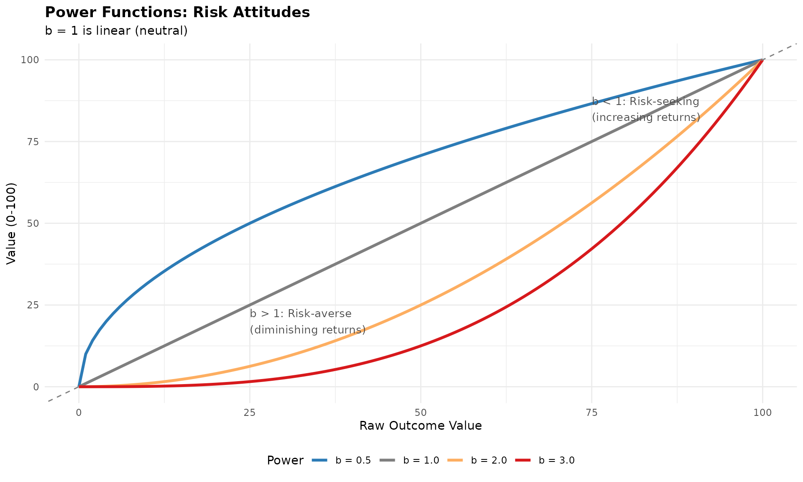

**When to use:** - Stakeholder elicitation reveals non-linear
preferences - Diminishing returns clinically meaningful (first 50%
efficacy more valuable) - Severity increases exponentially (rare but
catastrophic events) - Utility theory supports risk attitudes

**Example applications:** - Mortality (each life equally valuable -
linear or power=1) - Quality of life (diminishing returns at high
levels) - Rare serious AEs (exponential concern)

**Advantages:** - Captures risk attitudes - Single parameter (power) to
adjust - Smooth and differentiable

**Disadvantages:** - Requires justification for non-linearity - Power
parameter selection subjective - Less transparent than linear

------------------------------------------------------------------------

### 4. Sigmoid (S-shaped) Value Functions

**Description**: Slow change at extremes, rapid change in middle

$$v(x) = \frac{100}{1 + \exp\left( - k \times \left( x - \text{midpoint} \right) \right)}$$

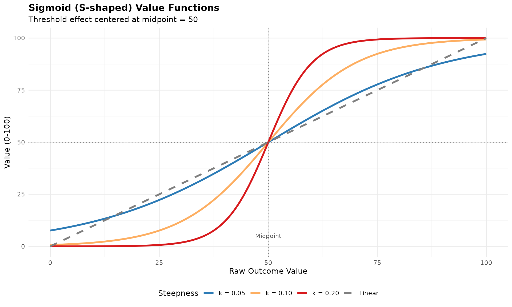

**When to use:** - Threshold effects (outcome “tips” at clinical
cutpoint) - Very low/high values matter less than mid-range -
Psychological preferences show S-shaped patterns - Binary clinical
decisions with gray zone

**Example applications:** - Biomarkers with clinical interpretation
thresholds - PROs with “clinically meaningful change” bands -
Dose-response with therapeutic window

**Advantages:** - Captures threshold effects - Smooth transition (no
sharp jumps) - Biologically/clinically realistic for many outcomes

**Disadvantages:** - Two parameters (midpoint, steepness) to justify -
Can be complex to explain - Requires clear rationale for threshold
location

------------------------------------------------------------------------

### 5. Step Functions (Discrete Categories)

**Description**: Discrete value levels for categorical outcomes

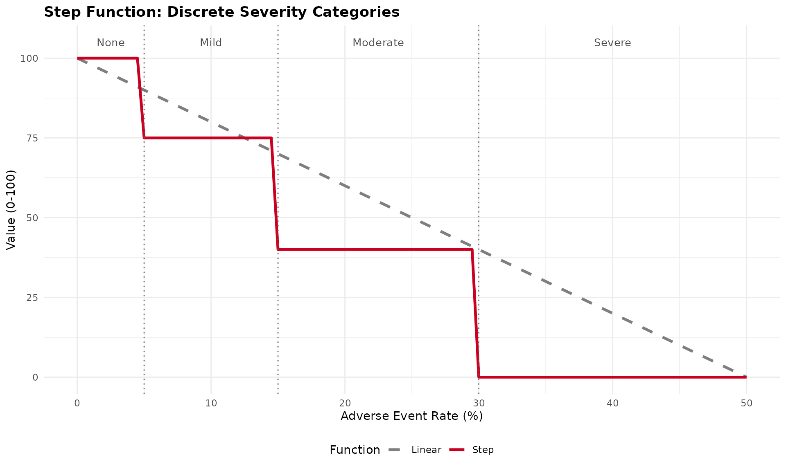

**When to use:** - Outcomes are inherently categorical (CTCAE grades) -
Clinical practice uses discrete classifications - No meaningful
distinction within categories - Regulatory guidance defines categories

**Example applications:** - CTCAE toxicity grades (1-5) - ECOG
performance status (0-4) - Disease severity classifications

**Advantages:** - Matches clinical practice - Simple interpretation -
Natural for categorical data

**Disadvantages:** - Ignores variation within categories - Sharp
discontinuities may not reflect reality - Can be sensitive to threshold
placement

------------------------------------------------------------------------

## Comparing Value Functions

Let’s visualize all function types for the same outcome:

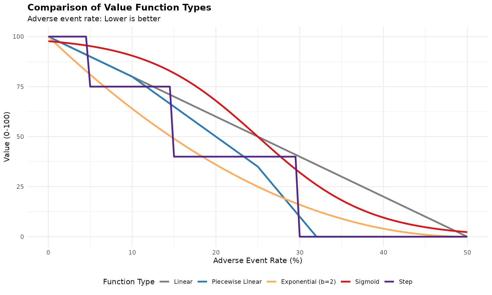

**Key observations:** - **Linear**: Constant concern across all levels -
**Piecewise**: Different concern in different ranges - **Exponential**:
Increasing concern (risk-averse) - **Sigmoid**: Threshold effect at
~25% - **Step**: Categorical interpretation

------------------------------------------------------------------------

## Regulatory and Practical Considerations

### FDA/EMA Guidance

**Default recommendation: Linear value functions** - Transparent and
conservative - Neutral assumption (no risk attitude imposed) - Easiest
to justify and explain

**When non-linear may be acceptable:** 1. Strong clinical/theoretical
rationale 2. Validated through stakeholder elicitation 3. Pre-specified
in analysis plan 4. Sensitivity analysis shows robustness 5. Documented
justification

### Selection Criteria

**Clinical validity:** - Does the function match clinical
understanding? - Are there clinical thresholds or categories? - Do
clinicians think linearly or non-linearly about this outcome?

**Stakeholder preferences:** - Elicit preferences using standard
techniques - Choice experiments - Swing weighting - Direct function
specification

**Data requirements:** - Linear: Only min/max thresholds - Piecewise:
Breakpoints and slopes - Exponential: Power parameter - Sigmoid:
Midpoint and steepness - Step: Category thresholds and values

**Interpretability:** - Can you explain it to regulators? - Can patients
understand it? - Does it make intuitive sense?

### Sensitivity Analysis

Always perform sensitivity analysis:

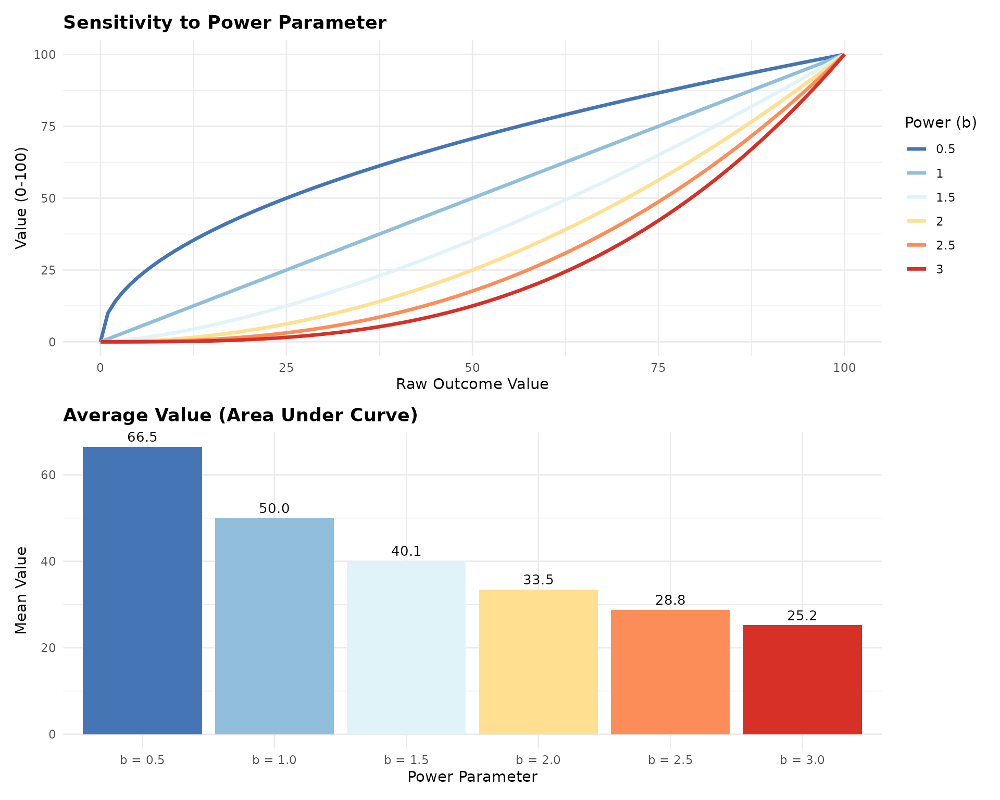

------------------------------------------------------------------------

## Recommendations

### 1. Start with Linear

- Default choice unless clear rationale for non-linear
- Easiest to justify and defend
- Regulatory preference

### 2. Consider Non-linear When:

- Clinical thresholds exist (→ piecewise or step)
- Stakeholder preferences clearly non-linear (→ power or sigmoid)
- Strong theoretical rationale (→ appropriate function type)
- Validated through preference elicitation

### 3. Document Everything

- Rationale for function choice
- Parameter selection process
- Stakeholder input
- Sensitivity analyses
- Clinical interpretation

### 4. Validate Choices

- Face validity with clinicians
- Stakeholder review
- Sensitivity analysis
- Comparison with alternative functions

### 5. Be Conservative

- When in doubt, use linear
- Simpler is better for communication
- Consider audience (regulators, patients, clinicians)

------------------------------------------------------------------------

## References

### Methodological

- Thokala P, et al. (2016). Multiple criteria decision analysis for
  health care decision making. *Value in Health*, 19(1):1-13.
- Keeney RL, Raiffa H. (1993). *Decisions with Multiple Objectives:
  Preferences and Value Trade-Offs*. Cambridge University Press.
- Dyer JS, Sarin RK. (1979). Measurable multiattribute value functions.
  *Operations Research*, 27(4):810-822.

### Regulatory

- FDA. (2013). Structured Approach to Benefit-Risk Assessment in Drug
  Regulatory Decision-Making.
- EMA. (2011). Benefit-Risk Methodology Project: Report of the BRMWP
  Task Force.
- PROTECT. (2012). Work Package 5: Benefit-Risk Integration and
  Representation.

### Applications

- Mussen F, et al. (2007). Structured benefit-risk assessment for
  medicinal products. *Pharmacoepidemiol Drug Saf*, 16(S1):S2-15.
- Mt-Isa S, et al. (2014). Balancing benefit and risk of medicines.
  *Clinical Pharmacology & Therapeutics*, 96(4):438-446.
- Levitan B, et al. (2018). Application of the BRAT framework to case
  studies. *Pharmacoepidemiol Drug Saf*, 27(11):1223-1234.

------------------------------------------------------------------------

## Implementation Note

The current `valueJudgementCE` package implements **linear value
functions** by default, which is consistent with FDA/EMA guidance and
provides a transparent, conservative approach to benefit-risk
assessment.

If you need to implement alternative value functions for specific
applications, the examples in this vignette provide the mathematical
framework. Always ensure proper documentation and justification for
non-linear choices.

------------------------------------------------------------------------

## Package Functions for Value Function Visualization

The `valueJudgementCE` package now includes dedicated functions for
visualizing linear value functions used in MCDA analyses:

### Single Value Function Plot

Create a plot showing how raw values transform to normalized scores
(0-100):

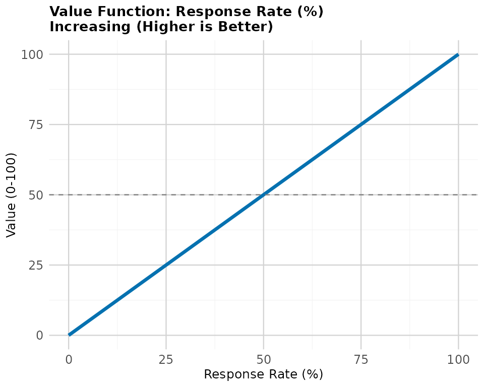

### Compare Benefits vs Risks

Create side-by-side comparison showing the different normalization
directions:

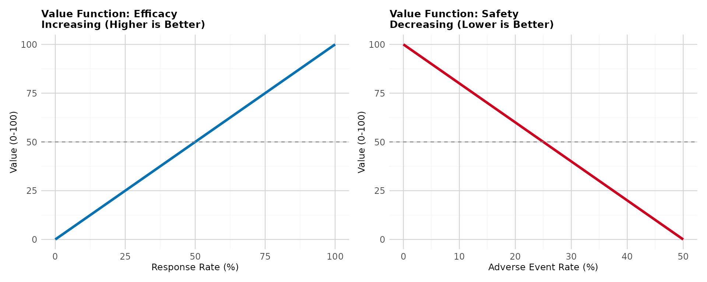

### Visualize All MCDA Criteria

Create a multi-panel plot for all criteria in your clinical scales:

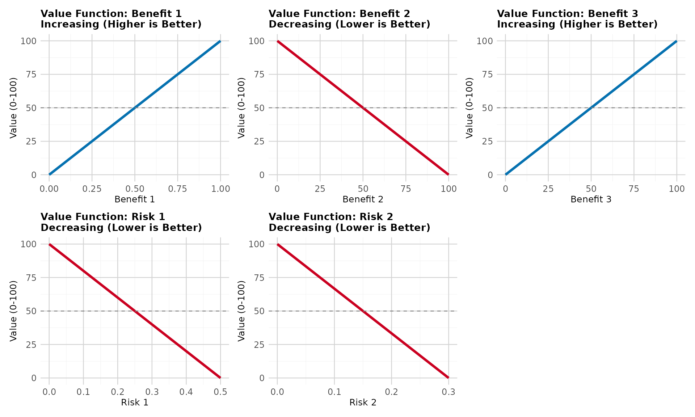

### Compare Linear to Alternative Value Function Types

Create comparison plots showing how linear functions compare to other
approaches (piecewise, exponential, sigmoid, step) for both benefits and
risks:

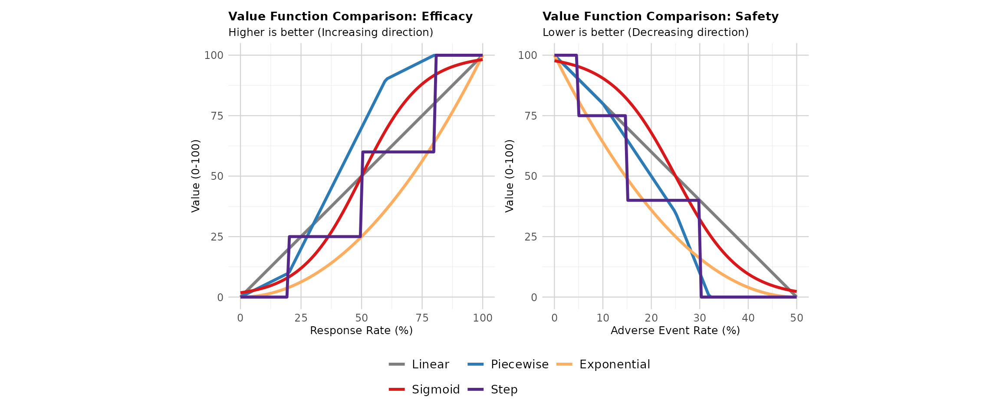

This visualization helps stakeholders understand: - How the **linear
function** (current standard, shown in gray) provides a neutral,
transparent approach - How **alternative functions** would transform the
same clinical data differently - Why regulatory agencies prefer linear
functions (simplicity, transparency, no imposed risk attitudes) - The
potential impact of choosing non-linear approaches on benefit-risk
conclusions

**Key observations:** - **Linear (Current Standard)**: Equal marginal
value across all levels - regulatory preference - **Piecewise Linear**:
Different slopes in different regions - useful when clinical thresholds
exist - **Exponential**: Captures diminishing returns or increasing
concern - requires stakeholder justification - **Sigmoid**: Threshold
effects with smooth transitions - useful for binary clinical
interpretations - **Step**: Discrete categories - matches categorical
clinical practice (e.g., CTCAE grades)

These functions help communicate the MCDA normalization process to
stakeholders and demonstrate the linear value function approach used
throughout the package.
