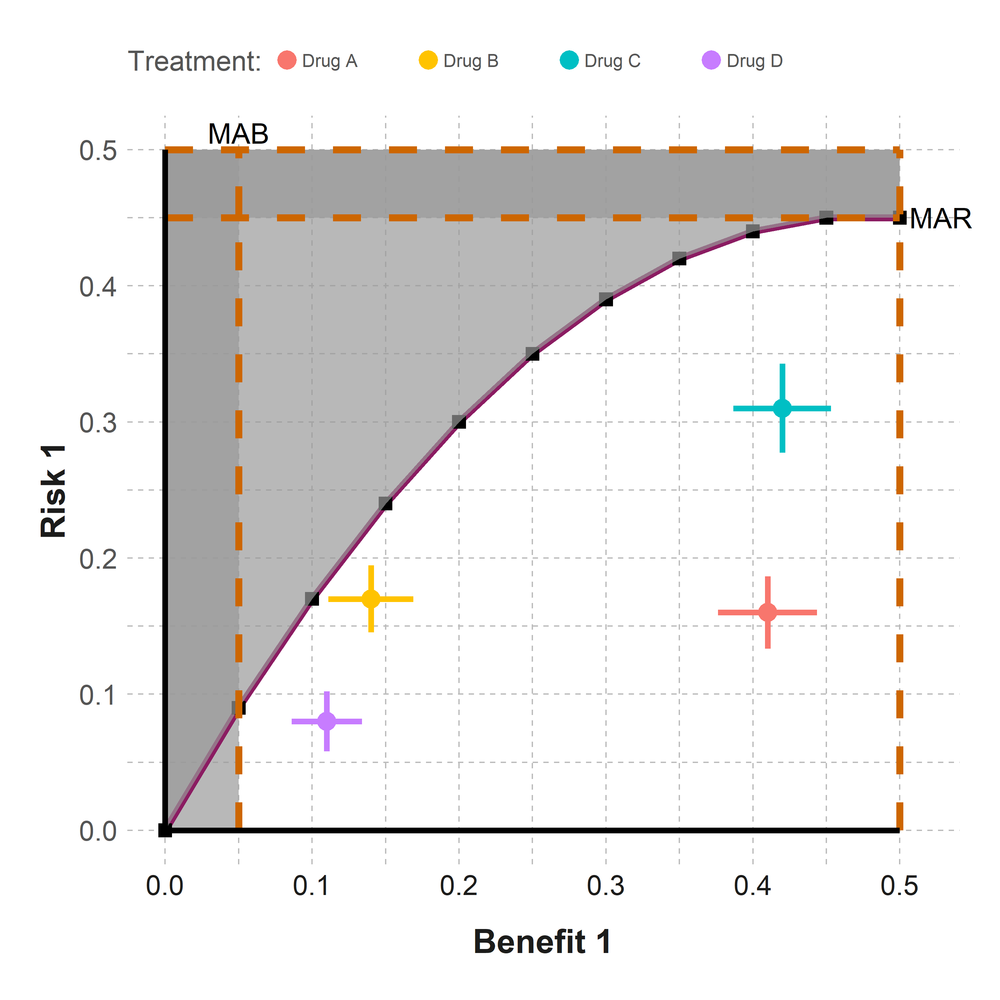
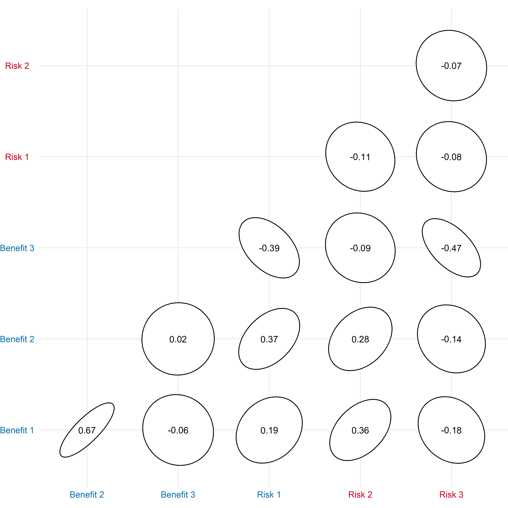
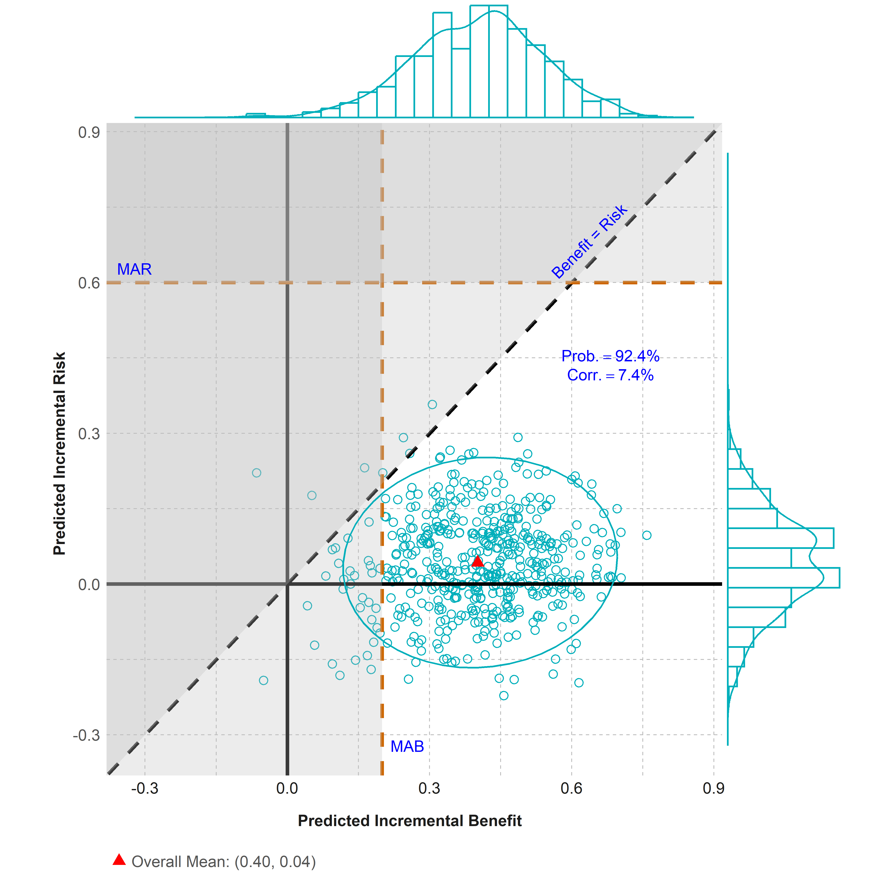
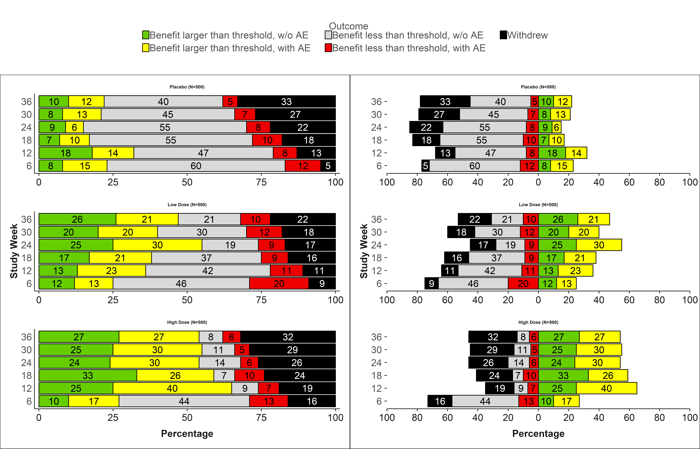
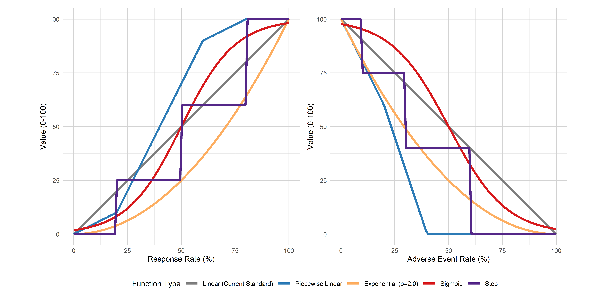
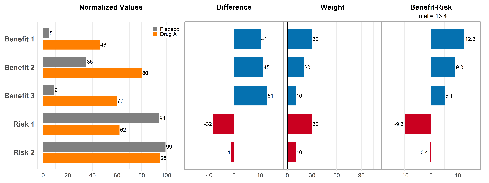
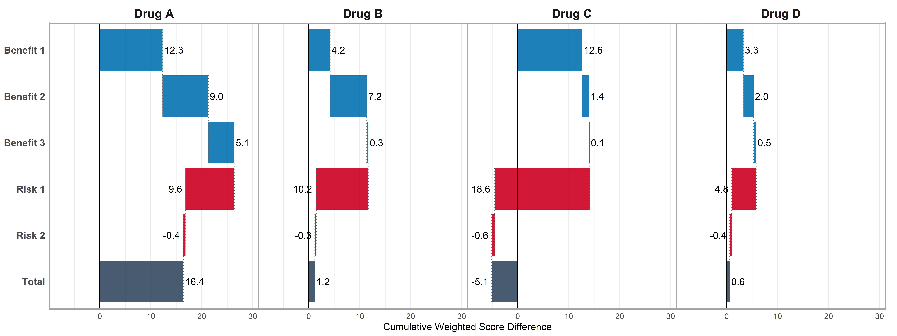
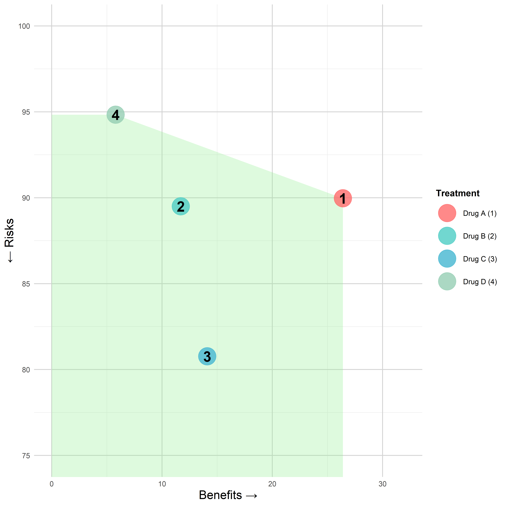
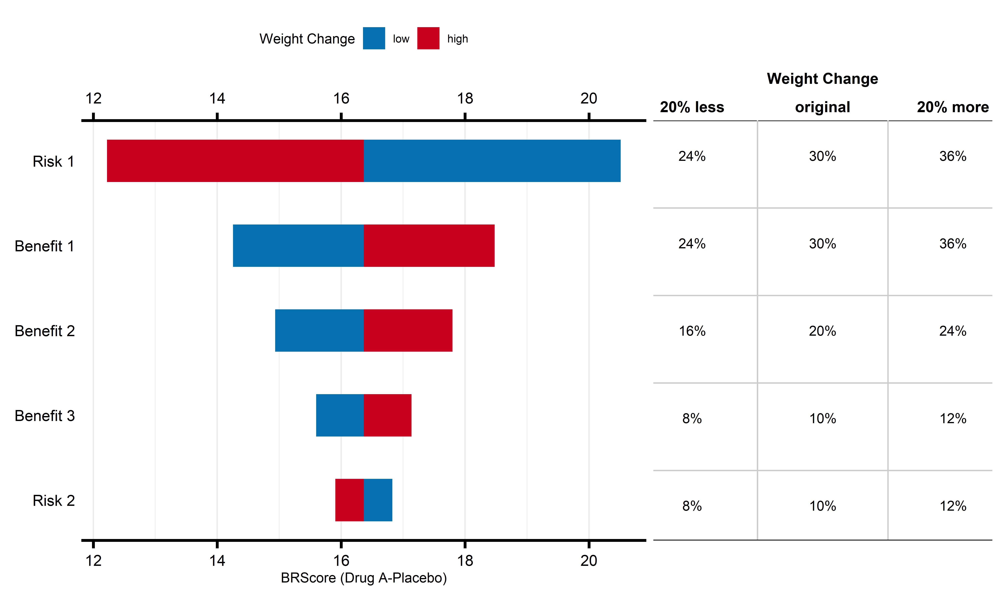

# brpubVJCE

The goal of brpubVJCE is to generate benefit-risk visualizations for the
publication “How to visually integrate value judgment with clinical
evidence”.

# Table of Contents

- [Installation](#installation)
- [Figure - Dot-Forest Plot](#figure---dot-forest-plot)
- [Figure - Trade-off Plot](#figure---trade-off-plot)
- [Figure - Correlogram](#figure---correlogram)
- [Figure - Scatter Plot](#figure---scatter-plot)
- [Figure - Divergent Stacked Bar
  Chart](#figure---divergent-stacked-bar-chart)
- [Figure - Cumulative Excess Plot](#figure---cumulative-excess-plot)
- [Figure - Value Function Types](#figure---value-function-types)
- [Figure - MCDA Comparison Plot](#figure---mcda-comparison-plot)
- [Figure - MCDA Waterfall Plot](#figure---mcda-waterfall-plot)
- [Figure - MCDA Benefit-Risk Map](#figure---mcda-benefit-risk-map)
- [Figure - MCDA Tornado Plot](#figure---mcda-tornado-plot)

## Installation

You can install the development version of brpubVJCE from
[GitHub](https://github.com/) using the following methods:

### Recommended Installation

``` r
# Install using pak (recommended)
install.packages("pak")
pak::pak("BR-Visualization/brpubVJCE")
```

### Alternative Installation

``` r
# Install using remotes
install.packages("remotes")
remotes::install_github("BR-Visualization/brpubVJCE")
```

## Figure - Dot-Forest Plot


Click to learn more

**Getting Help**

- Documentation: Use
  [`?create_forest_dot_plot`](https://pkgdown.r-lib.org/reference/create_forest_dot_plot.md)
  or
  [`?prepare_forest_dot_data`](https://pkgdown.r-lib.org/reference/prepare_forest_dot_data.md)
  for detailed function help
- Issues: Report bugs at [GitHub
  Issues](https://github.com/BR-Visualization/brpubVJCE/issues)  
- Discussions: Join discussions at [GitHub
  Discussions](https://github.com/BR-Visualization/brpubVJCE/discussions)
- Contact: Reach out to the package maintainers via GitHub

Click to view sample code

``` r
# Load the package and create the plot
library(brpubVJCE)

# Prepare the data and create the visualization
result_plot <- create_forest_dot_plot(
  prepare_forest_dot_data(effects_table)
)

# Display the plot
result_plot
```

## Figure - Trade-off Plot



Click to learn more

**Getting Help**

- Documentation: Use
  [`?generate_tradeoff_plot`](https://pkgdown.r-lib.org/reference/generate_tradeoff_plot.md)
  for detailed function help
- Issues: Report bugs at [GitHub
  Issues](https://github.com/BR-Visualization/brpubVJCE/issues)  
- Discussions: Join discussions at [GitHub
  Discussions](https://github.com/BR-Visualization/brpubVJCE/discussions)
- Contact: Reach out to the package maintainers via GitHub

Click to view sample code

``` r
library(brpubVJCE)

effects_table_filtered <- effects_table |>
  dplyr::filter(Outcome %in% c("Risk 1", "Benefit 1"))

generate_tradeoff_plot(
  data = effects_table_filtered,
  filter = "None",
  category = "All",
  benefit = "Benefit 1",
  risk = "Risk 1",
  type_risk = "Crude proportions",
  type_graph = "Absolute risk",
  ci = "Yes",
  ci_method = "Calculated",
  cl = 0.95,
  mab = 0.05,
  mar = 0.45,
  threshold = "Segmented line",
  ratio = 4,
  b1 = 0.05, b2 = 0.1, b3 = 0.15, b4 = 0.2, b5 = 0.25,
  b6 = 0.3, b7 = 0.35, b8 = 0.4, b9 = 0.45, b10 = 0.5,
  r1 = 0.09, r2 = 0.17, r3 = 0.24, r4 = 0.3, r5 = 0.35,
  r6 = 0.39, r7 = 0.42, r8 = 0.44, r9 = 0.45, r10 = 0.45,
  testdrug = "Yes",
  type_scale = "Free",
  lower_x = 0, upper_x = 0.5,
  lower_y = 0, upper_y = 0.5,
  chartcolors = colfun()$fig7_colors
)
```

## Figure - Correlogram



Click to learn more

**Getting Help**

- Documentation: Use
  [`?create_correlogram`](https://pkgdown.r-lib.org/reference/create_correlogram.md)
  for detailed function help
- Issues: Report bugs at [GitHub
  Issues](https://github.com/BR-Visualization/brpubVJCE/issues)  
- Discussions: Join discussions at [GitHub
  Discussions](https://github.com/BR-Visualization/brpubVJCE/discussions)
- Contact: Reach out to the package maintainers via GitHub

Click to view sample code

``` r
library(brpubVJCE)

create_correlogram(corr2)
```

## Figure - Scatter Plot



Click to learn more

**Getting Help**

- Documentation: Use
  [`?scatter_plot`](https://pkgdown.r-lib.org/reference/scatter_plot.md)
  for detailed function help
- Issues: Report bugs at [GitHub
  Issues](https://github.com/BR-Visualization/brpubVJCE/issues)  
- Discussions: Join discussions at [GitHub
  Discussions](https://github.com/BR-Visualization/brpubVJCE/discussions)
- Contact: Reach out to the package maintainers via GitHub

Click to view sample code

``` r
library(brpubVJCE)

outcome <- c("Benefit", "Risk")
scatter_plot(scatterplot, outcome, mab = 0.2, mar = 0.6)
```

## Figure - Divergent Stacked Bar Chart



Click to learn more

**Getting Help**

- Documentation: Use
  [`?divergent_stacked_barchart`](https://pkgdown.r-lib.org/reference/divergent_stacked_barchart.md)
  and
  [`?stacked_barchart`](https://pkgdown.r-lib.org/reference/stacked_barchart.md)
  for detailed function help
- Issues: Report bugs at [GitHub
  Issues](https://github.com/BR-Visualization/brpubVJCE/issues)  
- Discussions: Join discussions at [GitHub
  Discussions](https://github.com/BR-Visualization/brpubVJCE/discussions)
- Contact: Reach out to the package maintainers via GitHub

Click to view sample code

``` r
library(brpubVJCE)
library(cowplot)
library(gtable)

# Create both plots
stacked_bar_fig <- stacked_barchart(
  data = comp_outcome,
  chartcolors = colfun()$fig12_colors,
  ylabel = "Study Week"
)

divergent_stacked_bar_fig <- divergent_stacked_barchart(
  data = comp_outcome,
  chartcolors = colfun()$fig12_colors,
  favcat = c(
    "Benefit larger than threshold, with AE",
    "Benefit larger than threshold, w/o AE"
  ),
  unfavcat = c(
    "Withdrew",
    "Benefit less than threshold, w/o AE",
    "Benefit less than threshold, with AE"
  ),
  ylabel = "Study Week"
)

# Extract and combine with shared legend
stacked_bar_with_legend <- stacked_bar_fig + 
  labs(fill = "Outcome") +
  theme(legend.position = "top",
        legend.justification = "center",
        legend.box.just = "center",
        legend.title.align = 0.5) +
  guides(fill = guide_legend(nrow = 2, title.position = "top", title.hjust = 0.5))

g <- ggplotGrob(stacked_bar_with_legend)
legend <- g$grobs[[which(g$layout$name == "guide-box-top")]]

stacked_bar_no_legend <- stacked_bar_fig +
  theme(
    legend.position = "none",
    plot.background = element_rect(color = "black", fill = NA, linewidth = 0.5)
  )
divergent_stacked_bar_no_legend <- divergent_stacked_bar_fig +
  theme(
    legend.position = "none",
    plot.background = element_rect(color = "black", fill = NA, linewidth = 0.5)
  )

combined_plots <- plot_grid(stacked_bar_no_legend, divergent_stacked_bar_no_legend, ncol = 2)
plot_grid(legend, combined_plots, ncol = 1, rel_heights = c(0.2, 1))
```

## Figure - Cumulative Excess Plot


Click to learn more

**Getting Help**

- Documentation: Use
  [`?gensurv_combined`](https://pkgdown.r-lib.org/reference/gensurv_combined.md)
  for detailed function help
- Issues: Report bugs at [GitHub
  Issues](https://github.com/BR-Visualization/brpubVJCE/issues)  
- Discussions: Join discussions at [GitHub
  Discussions](https://github.com/BR-Visualization/brpubVJCE/discussions)
- Contact: Reach out to the package maintainers via GitHub

Click to view sample code

``` r
library(brpubVJCE)

gensurv_combined(
  df_plot = cumexcess, subjects_pt = 100, visits_pt = 6,
  df_table = cumexcess, fig_colors_pt = colfun()$fig13_colors,
  rel_heights_table = c(1, 0.5),
  legend_position_p = c(.1, 1.56),
  titlename =
    "Cumulative Excess # of Subjects w/ Events (per 100 Subjects)",
  mar = 32,
  mab = 15,
  mcd = 22
)
```

## Figure - Value Function Types



Click to learn more

**Getting Help**

- Documentation: Use
  [`?compare_value_function_types`](https://pkgdown.r-lib.org/reference/compare_value_function_types.md)
  for detailed function help
- Issues: Report bugs at [GitHub
  Issues](https://github.com/BR-Visualization/brpubVJCE/issues)  
- Discussions: Join discussions at [GitHub
  Discussions](https://github.com/BR-Visualization/brpubVJCE/discussions)
- Contact: Reach out to the package maintainers via GitHub

Click to view sample code

``` r
library(brpubVJCE)

compare_value_function_types(
  benefit_name = "Efficacy",
  benefit_min = 0,
  benefit_max = 100,
  benefit_label = "Response Rate (%)",
  risk_name = "Safety",
  risk_min = 0,
  risk_max = 100,
  risk_label = "Adverse Event Rate (%)",
  power = 2,
  show_titles = FALSE,
  show_legend = TRUE
)
```

## Figure - MCDA Comparison Plot



Click to learn more

**Getting Help**

- Documentation: Use
  [`?create_mcda_barplot_comparison`](https://pkgdown.r-lib.org/reference/create_mcda_barplot_comparison.md)
  for detailed function help
- Issues: Report bugs at [GitHub
  Issues](https://github.com/BR-Visualization/brpubVJCE/issues)  
- Discussions: Join discussions at [GitHub
  Discussions](https://github.com/BR-Visualization/brpubVJCE/discussions)
- Contact: Reach out to the package maintainers via GitHub

Click to view sample code

``` r
library(brpubVJCE)

create_mcda_barplot_comparison(
  data = mcda_data,
  study = "Study 1",
  benefit_criteria = c("Benefit 1", "Benefit 2", "Benefit 3"),
  risk_criteria = c("Risk 1", "Risk 2"),
  comparison_drug = "Drug A",
  clinical_scales = clinical_scales,
  weights = weights
)
```

## Figure - MCDA Waterfall Plot



Click to learn more

**Getting Help**

- Documentation: Use
  [`?create_mcda_waterfall`](https://pkgdown.r-lib.org/reference/create_mcda_waterfall.md)
  for detailed function help
- Issues: Report bugs at [GitHub
  Issues](https://github.com/BR-Visualization/brpubVJCE/issues)  
- Discussions: Join discussions at [GitHub
  Discussions](https://github.com/BR-Visualization/brpubVJCE/discussions)
- Contact: Reach out to the package maintainers via GitHub

Click to view sample code

``` r
library(brpubVJCE)

create_mcda_waterfall(
  data = mcda_data,
  comparator_name = "Placebo",
  benefit_criteria = c("Benefit 1", "Benefit 2", "Benefit 3"),
  risk_criteria = c("Risk 1", "Risk 2"),
  weights = weights,
  clinical_scales = clinical_scales
)
```

## Figure - MCDA Benefit-Risk Map



Click to learn more

**Getting Help**

- Documentation: Use
  [`?create_mcda_brmap`](https://pkgdown.r-lib.org/reference/create_mcda_brmap.md)
  for detailed function help
- Issues: Report bugs at [GitHub
  Issues](https://github.com/BR-Visualization/brpubVJCE/issues)  
- Discussions: Join discussions at [GitHub
  Discussions](https://github.com/BR-Visualization/brpubVJCE/discussions)
- Contact: Reach out to the package maintainers via GitHub

Click to view sample code

``` r
library(brpubVJCE)

create_mcda_brmap(
  data = mcda_data,
  comparator_name = "Placebo",
  benefit_criteria = c("Benefit 1", "Benefit 2", "Benefit 3"),
  risk_criteria = c("Risk 1", "Risk 2"),
  weights = weights,
  clinical_scales = clinical_scales,
  show_frontier = TRUE,
  show_labels = TRUE
)
```

## Figure - MCDA Tornado Plot



Click to learn more

**Getting Help**

- Documentation: Use
  [`?mcda_tornado`](https://pkgdown.r-lib.org/reference/mcda_tornado.md)
  for detailed function help
- Issues: Report bugs at [GitHub
  Issues](https://github.com/BR-Visualization/brpubVJCE/issues)  
- Discussions: Join discussions at [GitHub
  Discussions](https://github.com/BR-Visualization/brpubVJCE/discussions)
- Contact: Reach out to the package maintainers via GitHub

Click to view sample code

``` r
library(brpubVJCE)

mcda_tornado(
  data = mcda_data |> dplyr::filter(Study == "Study 1") |> dplyr::select(-Study),
  comparator_name = "Placebo",
  comparison_drug = "Drug A",
  weights = weights,
  clinical_scales = clinical_scales
)
```

## Citation

If you use this package in your research, please cite:

``` r
citation("brpubVJCE")
```

## License

This package is licensed under the MIT License. See the
[LICENSE](https://pkgdown.r-lib.org/LICENSE.md) file for details.

------------------------------------------------------------------------

*Built with ❤️ for the benefit-risk visualization community*
